# 暖心 Todo 产品需求文档（PRD）

> **版本**：V2.0 | **日期**：2026-07-20 | **负责人**：苗苗 

---

## 1. 产品概述

### 1.1 产品背景和市场分析

**市场环境**

自我管理类工具（待办清单、习惯打卡、番茄钟）市场已进入成熟期。主流产品包括：

| 产品     | 定位     | 核心优势       | 局限               |
| ------ | ------ | ---------- | ---------------- |
| 滴答清单   | 任务管理   | 跨平台同步、提醒丰富 | 界面偏工具化冷冰冰，缺乏情感激励 |
| Notion | 知识库+任务 | 高度自由定制     | 上手门槛高，移动端体验弱     |
| Forest | 专注/习惯  | 游戏化种植机制    | 功能单一，与日常事务割裂     |
| 微信待办   | 轻量入口   | 无需额外安装     | 缺少深度管理能力         |

**竞争格局与机会点**

当前市场存在一个明确空白：**温暖陪伴型自我管理产品**。市面产品要么偏任务执行（冷冰冰的清单），要么偏习惯打卡（与日常事务割裂），缺少一个既能降低启动门槛、又能形成长期正反馈的产品。随着 AI 大模型技术成熟，AI 助手辅助目标拆解成为新的差异化切入点。

**暖心 Todo 的市场定位**

- **不是**又一个 Todo App
- **而是**：一款以温暖治愈为情感基调、内置 AI 智能助手帮助用户把模糊想法变成可执行行动的移动端自我管理伴侣

### 1.2 目标用户群体及需求痛点

#### 1.2.1 目标用户

| 画像          | 标签           | 典型特征                       |
| ----------- | ------------ | -------------------------- |
| **学生党·小满**  | 18–24 岁，大学生  | 备考 / 论文 / 社团并行，需要拆解大目标，易拖延 |
| **职场新人·阿哲** | 22–28 岁，初级白领 | 事务杂、怕遗漏，想建立运动 / 阅读习惯       |
| **自律进阶·林姐** | 28–35 岁      | 已有习惯体系，需要复盘与优先级管理          |

#### 1.2.2 用户故事（核心）

- **作为**学生小满，**我希望**把准备考研说给 AI 听，**以便**它帮我拆成可执行的周计划。
- **作为**职场新人阿哲，**我希望**待办能标重要紧急，**以便**先处理真正要紧的事。
- **作为**用户，**我希望**完成待办后顺手打卡一个习惯，**以便**两个目标不脱节。
- **作为**用户，**我希望**卡住时 AI 给我鼓励而非冷冰冰提示，**以便**我愿意继续。

#### 1.2.3 使用场景

- **晨间规划**：打开 App → 看今日待办 + 习惯 → 用 AI 把当天任务排好。
- **碎片记录**：想到一件事 → 自然语言一句话建待办（明天下午 3 点交报告）。
- **晚间复盘**：总览页看完成度与象限分布 → 决定明天重点。

---

### 1.3 产品核心价值与定位

**核心价值主张**

| 价值维度       | 具体体现                                         |
| ---------- | -------------------------------------------- |
| **降低输入门槛** | 自然语言创建待办：明天下午3点和客户开会准备PPT，AI 自动提取时间/任务/关联项 |
| **智能辅助决策** | AI 把模糊目标拆解为结构化子任务树：准备期末考试→ 复习计划→刷题→模拟考     |
| **行为正反馈**  | 待办完成后弹窗询问是否同步为习惯；习惯连续打卡天数可视化激励               |
| **全局视野**   | 四象限优先级 + 日历视图 + 周视图 + 总览统计，从单日到跨周期复盘         |

---

## 2. 功能需求

### 2.1 功能列表

> 优先级采用 **P0（必做）/ P1（重要）/ P2（增强）**；验收标准以给定—当—则（Given-When-Then）描述，供测试写用例。

#### 2.1.1 待办管理

| 功能               | 用户价值         | 优先级 | 验收标准                                                         |
| ---------------- | ------------ | --- | ------------------------------------------------------------ |
| **创建待办（自然语言）**   | 一句话建任务，零表单负担 | P0  | 给定输入框，当用户输入明天下午3点交报告并发送，则生成待办：标题=交报告、时间=次日15:00、默认象限=重要不紧急 |
| **四象限分类**        | 区分重要/紧急，避免瞎忙 | P0  | 当创建待办选择象限，则列表按 重要紧急/重要不紧急/不重要紧急/不重要不紧急 分组展示                  |
| **多级子任务**        | 大目标拆成可执行步骤   | P0  | 当某待办展开，则可无限层级添加子任务（名称/类型/象限），总览递归展开任务树                       |
| **编辑 / 删除 / 完成** | 基本生命周期       | P0  | 当勾选完成，则触发待办完成询问习惯弹窗（见 §2.2 关键分支流程）                                 |

#### 2.1.2 习惯管理

| 功能             | 用户价值            | 优先级 | 验收标准                                       |
| -------------- | --------------- | --- | ------------------------------------------ |
| **新建习惯**       | 建立长期行为          | P0  | 当新建习惯填名称+频率+分类，则进入习惯展示页对应分类              |
| **分类打卡**       | 可视化坚持           | P0  | 当点击打卡，则当日标记完成、连续天数+1、展示环进度                 |
| **智能习惯推荐（AI）** | 降低想养什么习惯的决策成本 | P1  | 当用户输入目标（如想更健康），则 AI 返回 2–3 个推荐习惯卡片，可一键添加 |
| **待办→习惯联动**    | 闭环              | P0  | 当完成待办，则弹窗引导打卡关联习惯；当完成习惯，则引导处理待办（双向联动）      |

#### 2.1.3 AI 智能助手

| 功能          | 用户价值           | 优先级 | 验收标准                                            |
| ----------- | -------------- | --- | ----------------------------------------------- |
| **AI 对话页**  | 统一入口           | P0  | 当点击底部导航 AI，则打开 AI 对话页（界面保持在手机框内，不撑满全屏）          |
| **自然语言建待办** | 语音/打字即建        | P0  | 见 2.1.1 验收标准                                      |
| **NL 查询**   | 问我这周完成了什么即得答 | P1  | 当用户输入查询类语句，则基于本地数据返回结构化回答                       |
| **情感鼓励**    | 陪伴感            | P1  | 当检测到用户连续未完成或表达挫败，则返回温和鼓励文案（非说教）                 |
| **交互式任务拆解** | 大目标→任务树        | P1  | 当用户输入模糊大目标，则 AI 先提议拆解方案 → 询问确认 → 接受用户自己的思路整理后生成 |
| **长上下文记忆**  | 越用越懂你          | P2  | 当多次对话后，AI 能引用历史偏好（如你上次说备考）                    |
| **RAG 检索**  | 回答有据           | P2  | 当 AI 检索历史，则优先客户端 embedding 语义检索，无接口时降级本地词法      |

#### 2.1.4 账户与设置

| 功能                     | 用户价值 | 优先级 | 验收标准                                |
| ---------------------- | ---- | --- | ----------------------------------- |
| 登录 / 注册 / 忘记密码         | 基础账户 | P0  | 三页流程闭环，注册成功 / 重置密码成功有反馈弹窗           |
| 我的页（设置入口）              | 集中管理 | P0  | 当点击我的，则展示设置入口（含 AI 配置、编辑资料、欢迎语编辑） |
| 编辑资料 / 欢迎语编辑           | 个性化  | P1  | 当编辑欢迎语，则底部弹层编辑并实时保存                 |
| AI 配置（Embedding 模型/地址） | 高级可配 | P2  | 当修改 Embedding 配置，则可重建索引并提示成功        |

#### 2.1.5 视图与复盘

| 功能           | 用户价值   | 优先级 | 验收标准                         |
| ------------ | ------ | --- | ---------------------------- |
| 日历·月视图 / 周视图 | 时间维度规划 | P0  | 当切换周视图，则可点选日期查看当日任务          |
| 总览（统计+图表）    | 复盘     | P0  | 当打开总览，则展示完成度、象限分布、任务树（可递归展开） |
| 每日规划（时间轴）    | 当日编排   | P1  | 当打开每日规划，则按时间轴排列当日待办          |

---

### 2.2 交互流程及用户使用路径

提供用户从进入产品到完成目标的完整流程。

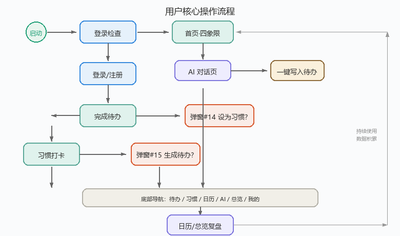

#### 主流程：首次使用路径

1. 启动 App
2. 登录检查 → 未登录则进入注册/登录页
3. 注册/登录成功后进入首页（显示欢迎引导）
4. 底部导航浏览各 Tab（待办 / 习惯 / 日历 / AI / 总览 / 我的）
5. 尝试添加第一个待办（支持 NL 自然语言输入）
6. 进入 AI 助手对话了解功能
7. 建立第一个习惯
8. 日复一日使用后进入总览进行数据复盘

#### 主流程：日常使用路径（已登录用户）

启动App后自动进入首页（四象限待办列表），用户可沿以下 5 条操作分支进行：

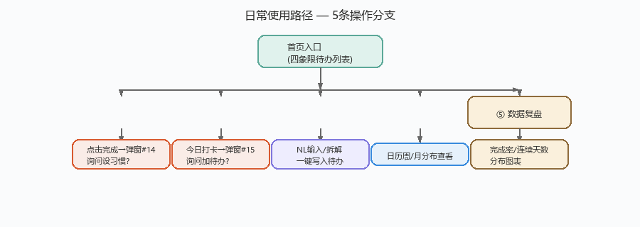

> **各分支说明：**
>
> - **① 待办管理**：查看今日待办 → 点击完成 → 弹窗(#14)询问是否设为习惯？
> - **② 习惯打卡**：切换到习惯页 → 今日打卡 → 弹窗(#15)询问是否生成相关待办？
> - **③ AI 辅助**：切换到 AI Tab → NL 自然语言输入 → AI 智能拆解 → 一键写入待办列表
> - **④ 时间视图**：切换到日历页 → 查看 周/月 分布
> - **⑤ 数据复盘**：切换到总览 → 查看统计数据（完成率 / 连续天数 / 分布图）

#### 关键分支流程

**分支1：待办完成联动**

1. 用户点击待办卡片的完成按钮
2. 弹出 #14 询问弹窗：太棒了！这个待办你想每天都做吗？
3. 用户选择：
   - 设为习惯→ 跳转至新建习惯页，名称预填充
   - 仅本次完成→ 标记完成，关闭弹窗

**分支2：习惯完成联动**

1. 用户点击习惯卡片的打卡按钮
2. 弹出 #15 询问弹窗：打卡成功！要不要顺便把相关待办也加上？
3. 用户选择：
   - 生成待办→ AI 根据习惯内容推荐关联待办
   - 不用了→ 标记完成，关闭弹窗

**分支3：AI 对话 → 创建待办**

1. 在 AI 对话页输入：帮我规划这周的学习
2. AI 返回拆解方案（多级子任务树）
3. 用户确认方案
4. 点击一键写入待办按钮
5. 返回首页，新增多个带层级关系的待办条目

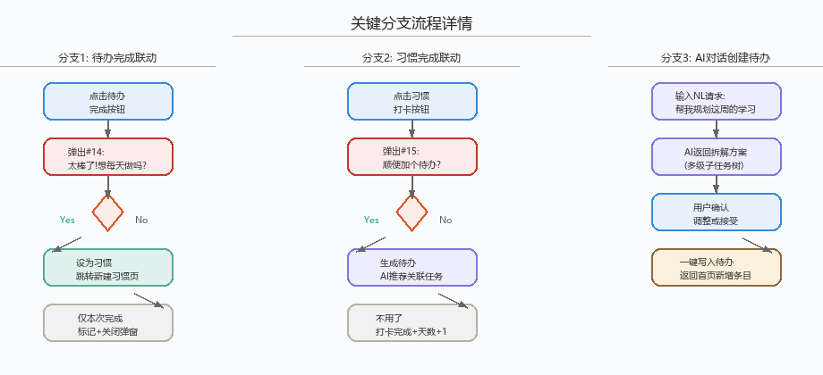

---

## 3. 非功能需求

### 3.1 性能要求

| 指标        | 目标值           | 说明                  |
| --------- | ------------- | ------------------- |
| 首屏加载时间    | ≤ 1.5s        | 4G 网络，冷启动           |
| AI 对话响应时间 | ≤ 3s          | API 调用端到端（不含用户思考时间） |
| 页面切换动画    | ≤ 300ms       | 底部 Tab 切换流畅无卡顿      |
| 最大并发用户数   | ≥ 1000 DAU 级别 | MVP 阶段              |
| 离线可用性     | 只读模式          | 已缓存的数据可在离线时查看       |

### 3.2 兼容性需求

| 类别       | 要求                               |
| -------- | -------------------------------- |
| 操作系统     | iOS 14+, Android 8.0+            |
| 浏览器（H5版） | Chrome 90+, Safari 14+, 微信内置浏览器  |
| 屏幕适配     | 主流手机分辨率（375×667 ~ 428×926），响应式布局 |
| 方向锁定     | 竖屏为主，日历/总览页支持横屏预览                |
| 无障碍      | 文字对比度 ≥ 4.5:1；触摸目标最小 44×44px     |

### 3.3 安全性需求

| 安全维度   | 具体要求                                          |
| ------ | --------------------------------------------- |
| 数据加密   | 传输层 TLS 1.3；敏感字段（密码、API Key）AES-256 加密存储      |
| 权限管理   | 基于用户 ID 的资源隔离；API Key 属于用户私有配置，不可跨用户访问        |
| 用户隐私   | 手机号脱敏展示（138\*\*\*\*1234）；不收集不必要的用户行为数据        |
| 认证方式   | 手机号+短信验证码作为主认证；密码 bcrypt 哈希存储                 |
| API 安全 | AI 后端接口速率限制（60 次/分钟/user）；防止 Prompt Injection |

---

## 4. 交互及 UI 设计

### 4.1 设计语言与规范

**视觉风格：温暖治愈系（Warm & Healing）**

| 元素   | 规范值                                                    | 说明            |
| ---- | ------------------------------------------------------ | ------------- |
| 主色   | `#5BA898`（青绿）                                          | 按钮、激活态、强调元素   |
| 背景色  | `#F7F6F3`（米白）                                          | 页面主背景         |
| 外层背景 | `linear-gradient(135deg, #e8f4ec → #d9edf5 → #eaf0fa)` | 浅薄荷→淡天蓝→浅雾蓝渐变 |
| 文字主色 | `#333333`                                              | 标题、正文         |
| 文字辅色 | `#999999`                                              | 占位符、说明文字      |
| 圆角   | 手机外框 32px，卡片 12px，按钮 8px                               | 全局统一圆角体系      |
| 字体   | Sarasa Gothic SC / PingFang SC / Microsoft YaHei       | 中文优先字体栈       |

**手机框架规格：**

- 尺寸：360 × 798 px（视觉稿）
- 圆角：32px
- 内边距：上下导航栏各 48px，内容区自适应

### 4.2 界面原型图

本节按模块展示全部 **21 个界面** 的界面原型截图，并对每个界面的关键区域与功能元素进行逐一标注说明。

---

#### ① 首页（Todo首页）

| 区域/元素    | 排版位置  | 作用说明                               |
| :------- | :---- | :--------------------------------- |
| 状态栏      | 顶部    | 时间 / 信号 / 电量（系统）                   |
| 欢迎语区域    | 顶部中央  | 晚上好，小林 · 7月13日 周一+ 自定义消息 + 头像    |
| 今日待办卡片   | 内容上半区 | 统计摘要（5项待办·已完成1项）+ 展开箭头             |
| 待办清单列表   | 内容中区  | 每项：复选框(✓=已完成) + 标题 + 时间 + 象限标签     |
| 今日习惯卡片   | 内容下半区 | 统计(6习惯·已打卡2个) + 连续天数徽章 + 打卡按钮      |
| FAB 浮动按钮 | 右下角悬浮 | 新建待办入口（可长按唤起NL快速输入）                |
| 底部导航栏    | 页面最底部 | 今日 / 日历 / 习惯 / 总览 / 我的 / AI（6 Tab） |

---

#### ② 添加待办页

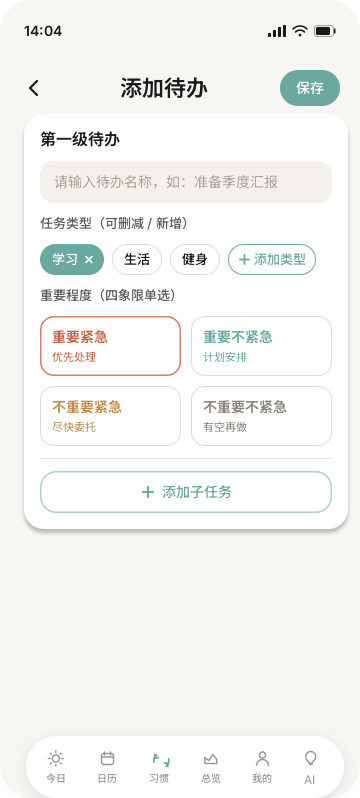

| 区域/元素         | 排版位置     | 作用说明                                     |
| :------------ | :------- | :--------------------------------------- |
| 返回箭头          | 左上角      | 返回上一页（首页）                                |
| 页面标题添加待办    | 顶栏中央     | 明确当前页面身份                                 |
| 待办标题输入框       | 表单第一行    | 手动填写待办名称（必填，最多50字）                       |
| 截止时间选择器       | 表单第二行    | 日期+时间 picker，默认为当天 18:00                 |
| 所属象限选择        | 表单第三行    | 单选：紧急重要 / 重要不紧急 / 紧急不重要 / 不紧急不重要         |
| 分类归属选择        | 表单第四行    | 下拉选择：工作 / 学习 / 生活 / 自定义（跳转 #12 清单选择页）    |
| 备注输入框         | 表单第五行    | 可选补充信息（最多200字）                           |
| NL 智能输入切换按钮 | 输入框右侧/下方 | 切换为自然语言模式：明天下午3点和客户开会准备PPT→ 自动解析填充以上字段 |
| 保存提交按钮      | 底部居中     | 校验必填项后保存并返回首页                            |

---

#### ③ AI 对话页（核心差异化界面）

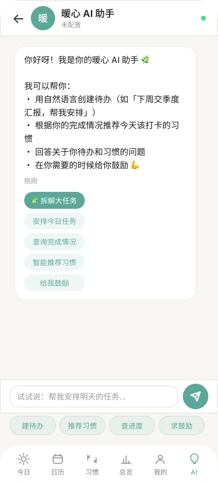

> **写入?决策点：** 当 AI 返回任务拆解时，用户可✓一键写入待办直接导入列表，或继续对话深入讨论。

| 区域/元素        | 排版位置    | 作用说明                                 |
| :----------- | :------ | :----------------------------------- |
| 返回箭头         | 左上角     | 返回上一 Tab/页面                          |
| 页面标题AI 助手  | 顶栏中央    | 当前所在功能标识                             |
| ⚙️ 设置齿轮      | 右上角     | 进入 AI 配置页（Base URL / API Key / 模型选择） |
| 第一行 Tab 栏    | 导航区     | 对话 / 规划 / 灵感 / 复盘 —— 4 个核心功能 Tab     |
| 第二行 Tab 栏    | 导航区     | 设置 / 关于 —— 2 个辅助功能 Tab               |
| 对话消息区域       | 页面主体    | 用户消息右对齐（气泡样式），AI 回复左对齐（含结构化内容）       |
| ✓ 一键写入待办按钮 | AI 回复下方 | 当 AI 返回任务拆解结果时出现，点击将方案直接导入待办列表       |
| 💡 快捷操作按钮组   | 消息区下方   | [建待办] [拆目标] [推荐习惯] —— 常用意图一键触发       |
| 输入框          | 底部固定    | 支持 NL 自然语言输入，placeholder 提示输入消息... |
| 发送按钮         | 输入框右侧   | 发送当前输入内容给 AI                         |

---

#### ④ 新建习惯页

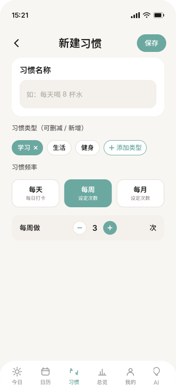

| 区域/元素      | 排版位置  | 作用说明                     |
| :--------- | :---- | :----------------------- |
| 返回箭头       | 左上角   | 返回习惯列表页                  |
| 页面标题新建习惯 | 顶栏中央  | 明确当前操作                   |
| 习惯名称输入框    | 表单第一行 | 如每天背30个单词（必填）          |
| 频率选择器      | 表单第二行 | 每天 / 每周N次 / 自定义周期        |
| 提醒时间设置     | 表单第三行 | 时间 picker，如 08:00        |
| 图标选择       | 表单第四行 | 从预设图标库中选择代表该习惯的 emoji/图标 |
| 关联待办模板（可选） | 表单第五行 | 选择该习惯完成后自动推荐的待办模板        |
| 保存习惯按钮   | 底部居中  | 创建新习惯并返回习惯展示页            |

---

#### ⑤ 习惯展示页

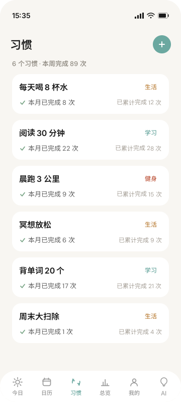

> 🔶 **状态机核心：** 每个习惯卡片有两种视觉状态——未完成态（白底+空心圆按钮）和已完成态（淡背景+✓实心圆），打卡操作触发状态翻转。

| 区域/元素          | 排版位置  | 作用说明                             |
| :------------- | :---- | :------------------------------- |
| 今日日期标题         | 顶部    | 如7月20日 · 今天要做的                 |
| 习惯卡片列表         | 内容主体  | 每张卡片包含：习惯名称 + 图标 + 连续天数徽章 + 打卡按钮 |
| 🔥 连续天数徽章      | 卡片右上角 | 如🔥 连续7天，视觉化正向激励               |
| 打卡按钮（未完成态）     | 卡片右侧  | 大圆角按钮，点击完成当日打卡                   |
| 已打卡状态          | 卡片整体  | 背景变淡 + 按钮变为✓ 已打卡               |
| + 新建习惯FAB 按钮 | 右下角悬浮 | 跳转到新建习惯页                         |

---

#### ⑥ 总览页

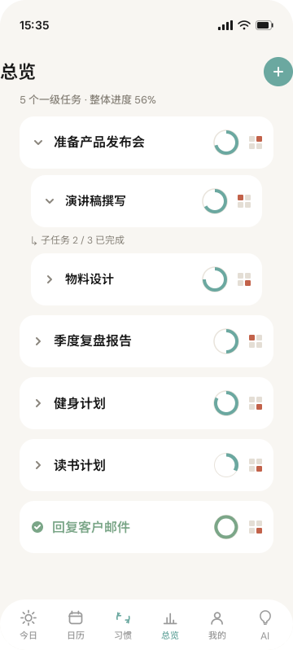

| 区域/元素      | 排版位置 | 作用说明                  |
| :--------- | :--- | :-------------------- |
| 时间范围选择器    | 顶部   | 本周 / 本月 / 自定义区间切换     |
| 完成率趋势折线图   | 图表区1 | 展示近 N 天待办完成率变化曲线      |
| 习惯连续天数排行榜  | 图表区2 | 横向柱状图，排名前 5 的习惯及其连续天数 |
| 四象限分布饼图    | 图表区3 | 各象限待办数量占比             |
| 本周亮点文字摘要 | 图表下方 | AI 生成的本周表现一句话总结       |

---

#### ⑦ 每日规划页

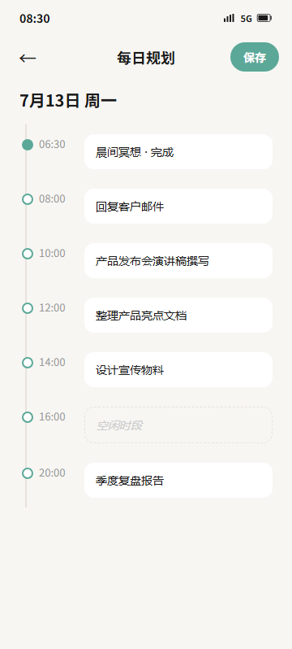

> 📅 右侧面板底部含**时间轴可视化**：展示全天时段分布，已完成时段以实心圆标记。

| 区域/元素    | 排版位置  | 作用说明                        |
| :------- | :---- | :-------------------------- |
| 返回+标题+保存 | 顶栏    | 返回首页 / 标识页面 / 保存当日规划        |
| 日期标题行    | 导航区下方 | 7月13日 周一                  |
| 时间线任务列表  | 内容主体  | 每个时段（06:30~20:00）对应一个待办任务卡片 |
| 完成状态标记   | 时段左侧  | 实心绿圆 = 已完成 / 空心圆 = 未完成      |

---

#### ⑧~㉑ 其余 14 个界面

#### ⑧~㉑ 其余 14 个界面

##### 日历视图（2 页）

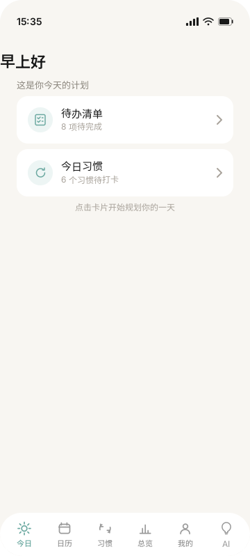

*月视图：月历网格 + 日期上的待办数量圆点标记 + 点击日期展开当日详情浮层*

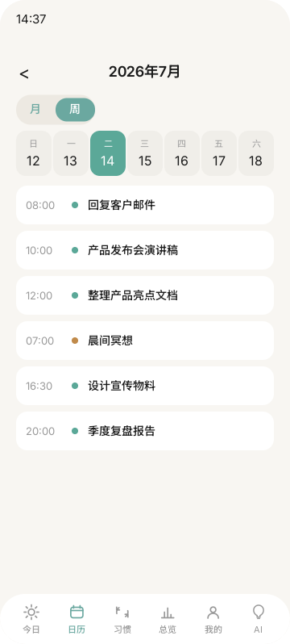

*周视图：7天横向时间轴 + 每日纵向排列待办和习惯，今日列高亮*

##### 个人中心 & 设置（4 页）

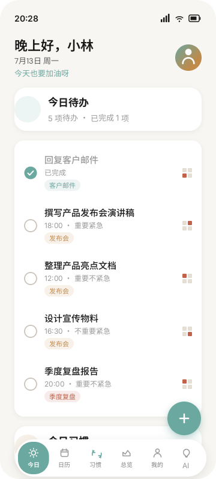

*我的页：头像 + 昵称 + 设置入口列表（编辑资料 / 欢迎语 / AI 配置 / 关于 / 退出登录）*

*编辑资料：上传头像 / 修改昵称 / 性别选择 / 个人简介编辑*

*欢迎语编辑：自定义首页顶部欢迎语文案（预设模板 + 自由输入 + 实时预览）*

##### 待办 & 习惯辅助（2 页）

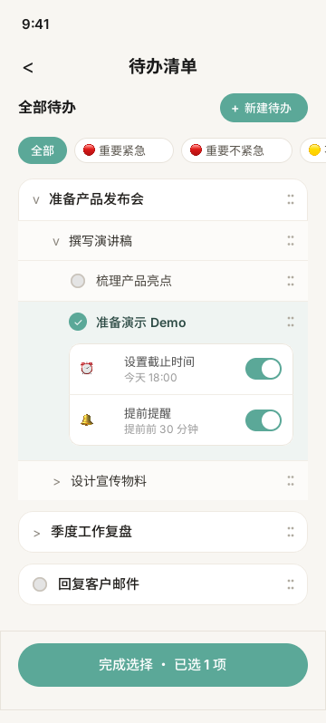

*待办清单选择：工作 / 学习 / 生活 / 自定义分类列表，支持搜索和新增分类*

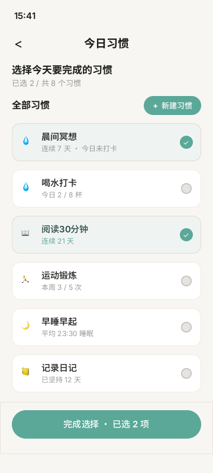

*今日习惯选择：勾选框列表，默认全选今日习惯，可取消个别*

##### 弹窗 & 账户流程（7 页）

**决策分支：太棒了！想每天都做吗？**

- ✅ **是** → 创建新习惯(#04)，自动填充待办标题为习惯名
- ❌ **否** → 仅标记完成，返回首页显示已状态

> 此弹窗在用户**完成待操作**时触发（非每次），通过正向激励引导用户养成习惯。

**决策分支：打卡成功！顺便加个待办？**

- ✅ **是** → AI 推荐关联待办模板 → 跳转#02添加待办(预填内容)
- ❌ **不用了** → 打卡完成，连续天数+1，返回习惯列表

> 此弹窗在用户**完成打卡操作**时触发，利用刚刚完成的动作作为上下文推荐关联待办，提高转化率。

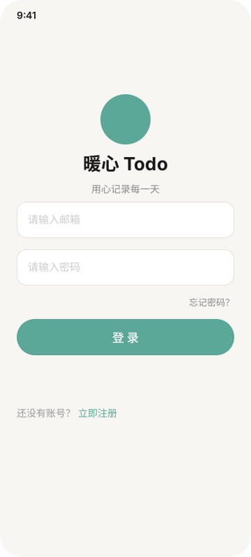

*登录页：手机号输入 + 验证码输入（获取验证码按钮60s倒计时）+ 登录按钮 + 底部三态切换（登录↔注册↔找回）*

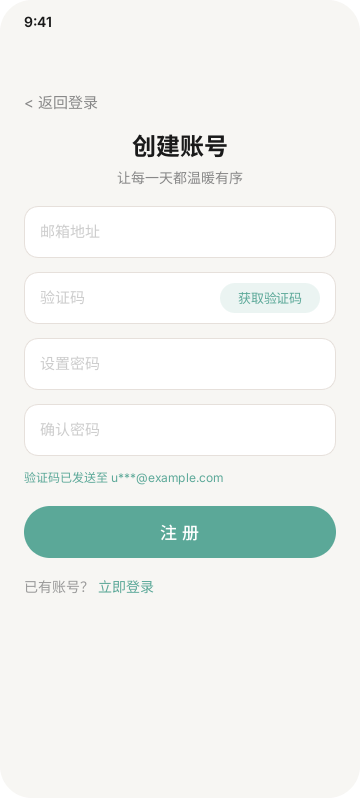

*注册页：手机号 + 验证码 + 设置密码 + 确认密码 + 注册按钮 → 成功后跳转#19*

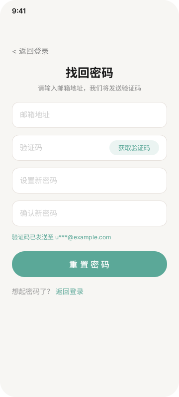

*忘记密码：手机号验证 + 新密码设置 + 确认密码 → 成功后跳转#20*

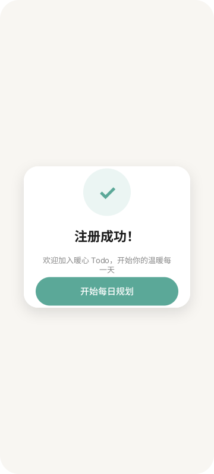

*注册成功弹窗：恭喜文案 + 去完善资料按钮引导至#09*

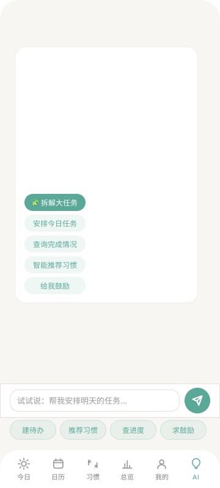

*重置成功弹窗：密码修改成功提示 + 返回登录按钮引导回#16*

---

### 4.3 关键界面设计原则

| 原则        | 具体实践                                             |
| --------- | ------------------------------------------------ |
| **易用性**   | 核心操作（添加待办/打卡/切换 Tab）≤ 2 次点击到达；NL 输入框始终可见         |
| **一致性**   | 全局统一色彩/圆角/间距/图标风格；弹窗样式一致（圆角 16px + 半透明蒙层）        |
| **美观度**   | 温暖配色（青绿+米白+渐变背景）；适度留白（≥ 16px 间距）；微交互动效（完成时的勾选动画） |
| **反馈及时性** | 操作后 200ms 内给出视觉反馈（按钮按下态/Loading/成功提示）            |
| **容错性**   | 删除操作需二次确认；误操作可撤销（Undo toast）；网络异常时友好提示           |

---

## 5. 技术与开发约束

### 5.1 开发技术栈选择

| 层          | 技术选型                          | 版本   | 说明                           |
| ---------- | ----------------------------- | ---- | ---------------------------- |
| **前端（H5）** | HTML5 + CSS3 + Vanilla JS     | —    | 单文件 index.html（2260+行），无框架依赖 |
| **后端 API** | Fastify (Node.js)             | v4.x | 轻量高性能 HTTP 框架                |
| **AI 引擎**  | ReAct Agent (LangChain.js)    | —    | 思维链推理 Agent，支持 RAG           |
| **数据存储**   | JSON 文件（开发阶段）                 | —    | MVP 阶段用文件存储，后续迁移数据库          |
| **部署**     | GitHub Pages (前端) + 云服务器 (后端) | —    | 前端静态托管，后端独立部署                |

### 5.2 依赖的第三方服务或 API

| 服务                | 用途            | 当前状态                          |
| ----------------- | ------------- | ----------------------------- |
| **LLM API**（用户自备） | AI 对话、任务拆解、推荐 | 用户在设置页自行配置 Base URL + API Key |
| **短信验证码服务**       | 注册/登录/找回密码    | 后续版本对接（当前用 mock）              |
| **GitHub API**    | 内容同步          | 通过 sync_github.py 脚本实现        |

**注意：AI 功能依赖用户提供自己的 LLM API Key，产品本身不内嵌大模型。** 这降低了合规风险和运营成本。

### 5.3 可能的技术挑战与解决方案

| 挑战                        | 风险等级 | 解决方案                                            |
| ------------------------- | ---- | ----------------------------------------------- |
| **AI 响应延迟影响体验**           | 中    | 流式输出（SSE）：逐 token 返回，首字 < 500ms；增加 Loading 骨架屏  |
| **NL 解析准确率不足**            | 高    | 限定领域（待办/习惯），结构化 prompt 工程；解析结果让用户确认后再写入         |
| **HTML 单文件体积过大**（2260+ 行） | 低    | 按模块拆分为多文件 + 构建打包（Vite/Webpack）；当前 MVP 阶段保持单文件即可 |
| **离线数据一致性**               | 低    | Service Worker 缓存策略；在线时后台同步冲突检测                 |
| **AI 页 DOM 异常撑满全屏**（历史回归） | 已修复  | 确保 page-ai 在 phone-frame div 内正确闭合；回归测试覆盖       |

---

## 6. 测试与验收标准

### 6.1 功能测试需求

| 测试类型      | 覆盖范围                                | 方法                         |
| --------- | ----------------------------------- | -------------------------- |
| **单元测试**  | 后端 API 路由、AI Agent 工具函数             | Jest / Node 内置 test runner |
| **集成测试**  | 前后端联调（登录→创建待办→AI对话→完成→统计链路）         | Playwright E2E             |
| **用户测试**  | 5-10 名目标用户进行可用性测试                   | 录屏+任务完成率+SUS量表             |
| **兼容性测试** | iOS Safari / Android Chrome / 微信浏览器 | BrowserStack / 真机测试        |
| **性能测试**  | 首屏加载、AI 响应时间、并发压力                   | Lighthouse / k6            |

### 6.2 关键业务逻辑验证方式

**核心功能验证矩阵：**

| 功能             | 验证方法                   | 通过标准                   |
| -------------- | ---------------------- | ---------------------- |
| NL 创建待办        | 输入 20 条不同格式的自然语言       | ≥ 90% 正确提取出标题/时间       |
| AI 目标拆解        | 输入 5 个模糊目标             | 拆解结果合理且可一键导入           |
| 待办↔习惯联动        | 完成待办→弹窗→设为习惯→次日可见      | 全链路无断裂                 |
| 四象限排序          | 手动拖拽待办到不同象限            | 位置正确保存并在刷新后保持          |
| 登录注册           | 正常/异常/边界情况（空输/错码/网络断开） | 全部走通并有友好提示             |
| **回归：AI 页不撑满** | 点击导航 AI Tab → 检查渲染范围   | AI 页在 360×798 手机框内，不超出 |

### 6.3 产品验收标准及上线条件

**P0 功能 100% 通过方可上线：**

- [ ] 用户可通过手机号注册/登录/找回密码
- [ ] 首页正确显示四象限待办列表
- [ ] 可添加/编辑/删除/完成待办
- [ ] 可新建/编辑/打卡习惯
- [ ] AI 对话页正常工作（用户自配 API Key 后）
- [ ] 底部 6 Tab 切换正常，每个 Tab 页在手机框架内渲染
- [ ] 外层背景为明朗清新渐变（非深色）

**P1 功能应在上线后 2 周内补齐：**

- [ ] 日历（月视图 + 周视图）
- [ ] 每日规划页
- [ ] 待办/习惯完成联动弹窗
- [ ] 个人资料编辑

**质量门禁：**

- [ ] Lighthouse Performance Score ≥ 80
- [ ] 关键用户路径 E2E 测试通过率 100%
- [ ] 无 P0/P1 级别已知 Bug
- [ ] AI 页回归测试通过（DOM 不撑满全屏）
